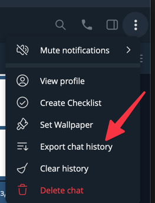
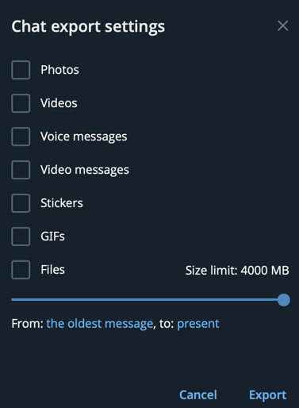
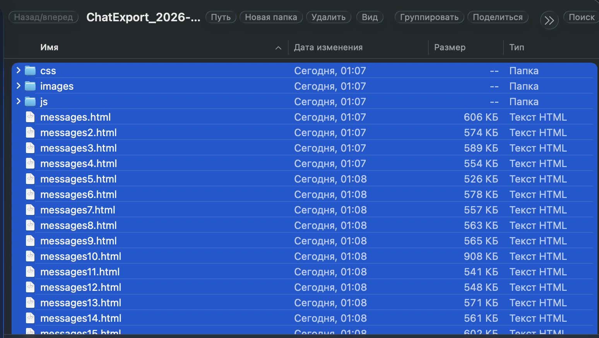

## Анализатор сообщений телеграмма
Важно. Этот код был полностью написан нейросетью под небольшим моим руководствам. 
Он не является ни хорошим, ни доработанным. 
Вполне возможно что тут что-то упущено и тд.
Сделан just for fun


## Как работать?
Для начала вам необходимо экспортировать чат из telegram:



Далее экспортировать только текст



Дождаться экспорта 



и скопируйте путь до этой директории, то есть до 
`ChatExport_*`

После склоньте проект и запустите скрипт
```bash
git clone https://github.com/JABAN111/TelegramMessageAnalyzer.git
```

```bash
go run -data="path_to_ChatExport_*" -output="where_reports_shall_spawn"
```

## Готовые релизы
Отдельная [релизная страница](RELEASES.md) содержит ссылки на сборки под Windows, macOS и Linux, а также команды для самостоятельной сборки.

### Быстрый запуск бинарников
- **Windows:** `TelegramMessageAnalyzer_windows_amd64.exe -data "C:\Path\To\ChatExport_*" -output "C:\Path\To\Reports"`
- **macOS:** `./TelegramMessageAnalyzer_darwin_universal -data="/Users/you/ChatExport_*" -output="/Users/you/Reports"`
- **Linux:** `./TelegramMessageAnalyzer_linux_amd64 -data="~/ChatExport_*" -output="~/reports"`

Enjoy:D


